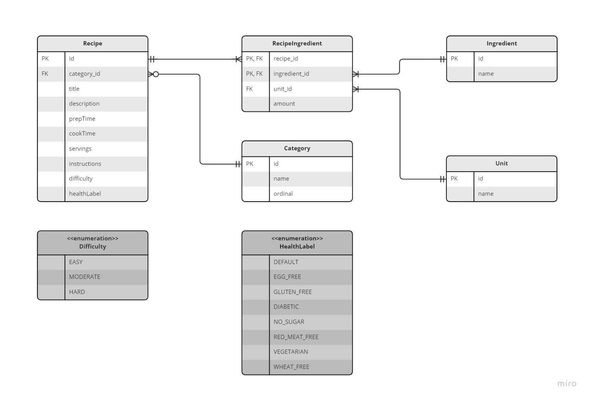

## Architecture

The entity relationship in the project is shown on the following ER Diagram:

 

As it is known, a recipe has many ingredients and an ingredient may belong to many recipes. Therefore, a many to many relationship is created between these entities. For this purpose, a bridge entity is used by creating one to many relationship between Recipe - RecipeIngredient and Ingredient - RecipeIngredient entities.

On the other hand, in order to prevent data repetition for the Ingredient, amount and unit fields are kept in the bridge entiy. Otherwise, when the same ingredient is used for several recipes with different amount and unit, then the same ingredient would have to be created as it is used with different amount. With the help of this approach, users can use the same ingredient with different amount and unit and they don't need to create new record for the same ingredient.

For recipe category and ingredient unit, new entities are created. On the other hand, for difficulty and health label of recipe 2 enums are created.

The relationship between all of these entities are shown on the ER Diagram.

There are separate endpoints for Recipe, Ingredient, Category and Unit. By using these endpoints, it is possible to find, create, update and delete record for the related entities.

A dynamic filtering and sorting mechanism is implemented via `Spring Data JPA Specification`. By using this function, it is possible to retrieve records by sorting and based on a field value.

For a better performance, pagination is used and the results are returned as page.

For detailed search of recipes, another search method is also implemented. In this implementation, `PostgreSQL`'s Text Search feature is used with `Spring Data JPA @Query`. With this approach, it is possible to search a recipe based on ingredient paremeters besides recipe parameters.

While creating a recipe, ingredients can also be created and added as they can also be selected among the current ingredients created before. If there is an ingredient with the same name as the new ingredient name, the app warns the user and does not let duplicate ingredient.

By using RecipeIngredient endpoint, it is possible to add/remove an ingredient to/from a recipe.

For handling exceptions, a global exception handler is used (`GlobalExceptionHandler`).

For validating ingredients for checking multiple names in the same recipe, a custom validator is used (`IngredientValidator`).

 
 

