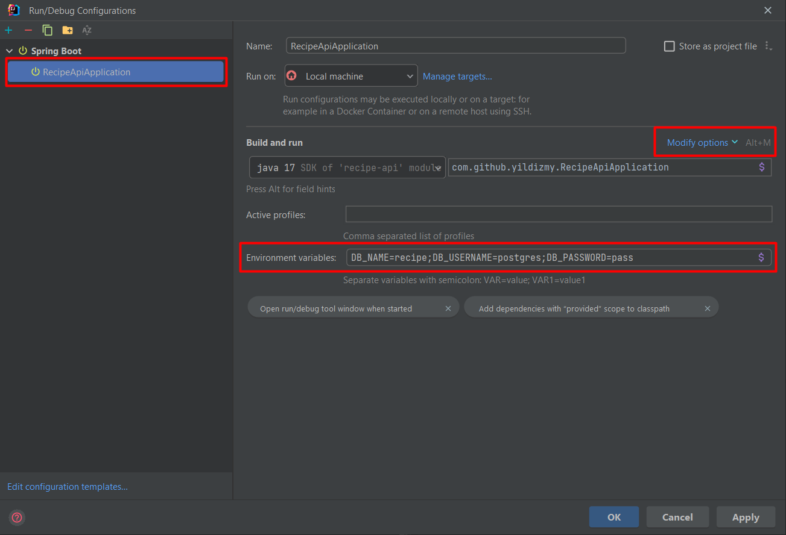

## How to run?

The application can be run in development or production mode by applying the following steps.
<br/>

### Prerequisites

The following apps and tools should be installed before running the application:

- A command line app

- Docker Desktop. For more information regarding the system requirements, etc. refer to the following pages:

[Install on Mac](https://docs.docker.com/desktop/install/mac-install/)<br/>
[Install on Windows](https://docs.docker.com/desktop/install/windows-install/)<br/>
[Install on Linux](https://docs.docker.com/desktop/install/linux-install/)<br/>

<br/>

### Running app in Development mode

In order to run the application in development mode, apply the following steps:


1. Run Docker desktop.

<br/>


2. Open command prompt window and clone the project from GitHub using the following command:

```
git clone https://github.com/yildizmy/recipe-app.git
```
<br/>

3. Change the current directory to the project directory where the `docker-compose.yml` file is in:

```
cd recipe-app
```
<br/>


4. Run the following command:

```
docker compose up -d
```

<br/>


5. Open project using IntelliJ IDEA, select _Run > Edit Configurations_ and add the following parameters to the Environment variables field (these values should be same as the values as in the `.env` file).

```
DB_NAME=recipe;DB_USERNAME=postgres;DB_PASSWORD=pass
```
<br/>


> **Note** If Environment variables field is not available, it can be added via Modify options menu.



<br/>

6. Then the database container starts up after build. This process can take several minutes based on the internet connection. 
After this step is completed, run the application using IntelliJ IDEA and then send request to the endpoints. 
For this purpose, see the details on [How to test?](how_to_test.md) section.

<br/>

### Running app in Production mode

In order to run the application in production mode, apply the following steps:

1. Open command prompt window and clone the project from GitHub using the following command:

```
git clone https://github.com/yildizmy/recipe-app.git
```
<br/>


2. Open `.env` file located in project root and update `DB_NAME`, `DB_USERNAME` and `DB_PASSWORD` parameter values in it:

```
DB_NAME=recipe
DB_USERNAME=postgres
DB_PASSWORD=pass
```

> **Note** When you run `docker compose up`, the environment variables are set with the values in the .env file. </br>
> For more information: https://docs.docker.com/compose/environment-variables/set-environment-variables/

<br/>

3. Run Docker desktop.

<br/>

4. Open command prompt window. Change the current directory to the project directory where the `docker-compose.yml` file is in:

```
cd recipe-app
```
<br/>

5. And run the following command:

> **Note** If IntelliJ IDEA is running, first stop it before running this command to prevent possible port errors.

```
docker compose -f docker-compose.yml -f docker-compose.prod.yml up
```

<br/>


6. Then the database and application containers start up after build. This process can take several minutes based on the internet connection. After this step is completed, send request to the endpoints. For this purpose, see the details on [How to test?](how_to_test.md) section.


<br/>

### Troubleshooting

* If there is any process using the same port of with the application (port 8080), _"port is already in use"_ error is
  encountered. In this situation, terminating that process and restarting the related containers will fix the problem. If it is not solved, try to run `docker compose up` command and the following steps.

<br/>

### Documentation

[docker compose up](https://docs.docker.com/engine/reference/commandline/compose_up/)<br/>


<br/>
<br/>